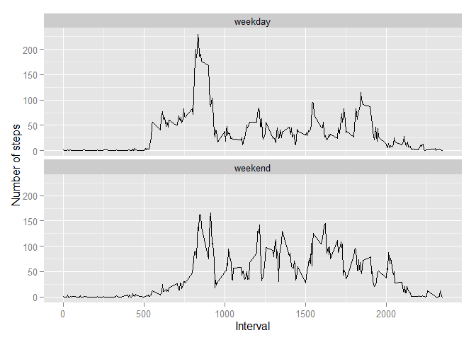

# Reproducible Research: Peer Assessment 1


```r
# setting up working directory
setwd("C:\\Coursera\\Coursera - Data Science track\\git\\RepData_PeerAssessment1")

# unzipping data
unzip('activity.zip')
```

## Loading and preprocessing the data
Show any code that is needed to

1. Load the data (i.e. read.csv())

2. Process/transform the data (if necessary) into a format suitable for your analysis


```r
# load data
activity <- read.csv("activity.csv")

# transform string to date
activity[,2] <- as.Date(activity[, 2], "%Y-%m-%d")

# print first 5 rows
head(activity)
```

```
##   steps       date interval
## 1    NA 2012-10-01        0
## 2    NA 2012-10-01        5
## 3    NA 2012-10-01       10
## 4    NA 2012-10-01       15
## 5    NA 2012-10-01       20
## 6    NA 2012-10-01       25
```

## What is mean total number of steps taken per day?
For this part of the assignment, you can ignore the missing values in the dataset.

1. Calculate the total number of steps taken per day

2. If you do not understand the difference between a histogram and a barplot, research the difference between them. Make a histogram of the total number of steps taken each day


3. Calculate and report the mean and median of the total number of steps taken per day


```r
# steps taken per day
act_by_day <- aggregate(. ~ date, activity[-3], sum)

# print first 5 rows
head(act_by_day,5)
```

```
##         date steps
## 1 2012-10-02   126
## 2 2012-10-03 11352
## 3 2012-10-04 12116
## 4 2012-10-05 13294
## 5 2012-10-06 15420
```

```r
# plot histogram
hist( act_by_day$steps
    , breaks = 11
    , main = "Number of steps per day"
    , xlab = "Number of steps per day " )
```

 

```r
# show summary
summary(act_by_day$steps)
```

```
##    Min. 1st Qu.  Median    Mean 3rd Qu.    Max. 
##      41    8841   10760   10770   13290   21190
```


The mean is **10770** and the median is **10760**.

## What is the average daily activity pattern?
1. Make a time series plot (i.e. type = "l") of the 5-minute interval (x-axis) and the average number of steps taken, averaged across all days (y-axis)

2. Which 5-minute interval, on average across all the days in the dataset, contains the maximum number of steps?


```r
# Calculate the average number of steps taken for each interval
act_by_interval <- aggregate(. ~ interval, activity[-2], mean)
# create plot
plot( act_by_interval
    , type = "l"
    , main = "Average number of steps taken, averaged across all days"
    , ylab = "Average number of steps " )
```

 


```r
# find the maximum of total steps in one interval
max_steps <- max(act_by_interval[,2])

# find the rownum of max_steps
rownum <- match(max_steps, act_by_interval$steps)

# find the interval containing max_steps
act_by_interval[rownum,]
```

```
##     interval steps
## 104      835 206.2
```

On average, across all the days in the dataset, interval **835** contains the maximum number of steps

## Imputing missing values
Note that there are a number of days/intervals where there are missing values (coded as NA). The presence of missing days may introduce bias into some calculations or summaries of the data.

1. Calculate and report the total number of missing values in the dataset (i.e. the total number of rows with NAs)

2. Devise a strategy for filling in all of the missing values in the dataset. The strategy does not need to be sophisticated. For example, you could use the mean/median for that day, or the mean for that 5-minute interval, etc.

3. Create a new dataset that is equal to the original dataset but with the missing data filled in.

4. Make a histogram of the total number of steps taken each day and Calculate and report the mean and median total number of steps taken per day. Do these values differ from the estimates from the first part of the assignment? What is the impact of imputing missing data on the estimates of the total daily number of steps?


```r
# Total number of missing values
sum(is.na(activity$steps))
```

```
## [1] 2304
```


The total number of missing values in the dataset is **2304**.


My strategy is to calculate the mean for each interval. I replace the NA values with these calculated means.


```r
# find al NA values
isna <- is.na(activity$steps)

# create data set with dates containing NA's
isna_dates <- activity$date[isna]

# create data set with dates containing steps
isok_dates <- activity$date[!isna]

# no dates exist that contain NA's as well as steps
intersect(isna_dates,isok_dates)
```

```
## numeric(0)
```

```r
# number of days in data frame
total_days <- length(unique(activity$date))

# repeat act_by_interval as many times as we have days.
act_by_interval_rep <- rep(act_by_interval$steps, total_days)

# data frame that will contain 'repaired' activity
activity_repaired <- activity
activity_repaired[isna,]$steps <- act_by_interval_rep[isna]
```


```r
# steps taken per day
act_rep_by_day <- aggregate(. ~ date, activity_repaired[-3], sum)

# show histogram
hist( act_rep_by_day$steps, breaks = 11
    , main = "Number of steps per day"
    , xlab = "Number of steps per dayy" )
```

 

```r
# show summary
summary(act_rep_by_day$steps)
```

```
##    Min. 1st Qu.  Median    Mean 3rd Qu.    Max. 
##      41    9820   10800   10800   12800   21200
```


The mean is **10800** and the median is **10800**.

As well the mean as the median are a bit higher now. The mean and the median also have the same value now.


## Are there differences in activity patterns between weekdays and weekends?
For this part the weekdays() function may be of some help here. Use the dataset with the filled-in missing values for this part.

1. Create a new factor variable in the dataset with two levels - "weekday" and "weekend" indicating whether a given date is a weekday or weekend day.

2. Make a panel plot containing a time series plot (i.e. type = "l") of the 5-minute interval (x-axis) and the average number of steps taken, averaged across all weekday days or weekend days (y-axis). See the README file in the GitHub repository to see an example of what this plot should look like using simulated data.


```r
# adding column 'daytype'
daytype <- ifelse(weekdays((activity_repaired[,2])) %in% c("Saturday","Sunday"), "weekend","weekday")

# creating factor variable
activity_repaired$daytype <- as.factor(daytype)


# aggregate by interval, daytype
act_rep_by_interval <- aggregate(activity_repaired$steps, by=list(activity_repaired$interval,activity_repaired$daytype), FUN=mean)

# plot
library(ggplot2)
gg <- ggplot(act_rep_by_interval, aes(Group.1,x) )
gg + geom_line() + facet_wrap ( ~ Group.2 , nrow=2 , ncol=1 ) + labs(y = "Number of steps") + labs(x = "Interval")
```

 


